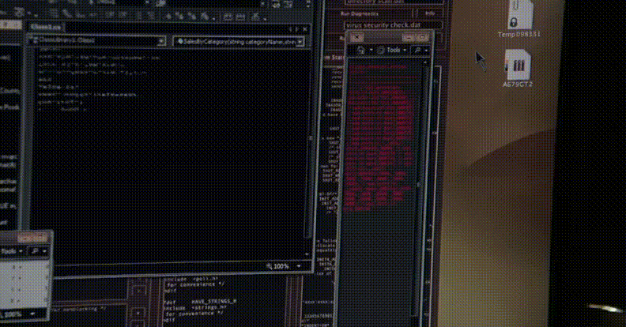

# ImageCryptor
Encrypt & decrypt image files using AES encryption.

### For what?
Mostly just for lulz.

### Requirements?
For release: only Windows.
For development: pycryptodome, py2exe.

### What about security?
It is not secure, the key and the encrypted data are stored in the same file, which makes such encryption meaningless.
On the other hand, the code can be modified so that it somehow changes the IV and the key, which will require you to have a copy of the program to decrypt.
But I personally don't need that, so okay.

### What is my inspiration?
When I was revisiting my favorite TV show "Person of Interest" again, there was a moment in Season 2 of Episode 18 (timecode: 41:48) in which Finch and Reese talked about Grace, Finch's ex-wife, and how he defended her. After the conversation, he went to his computer, and transferred the encrypted file to some program that automatically decrypted it and showed a joint photo of Finch and Grace. I was so moved by this moment that I wanted to make myself such a program.

